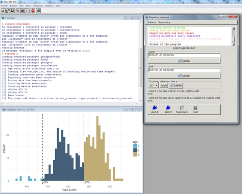
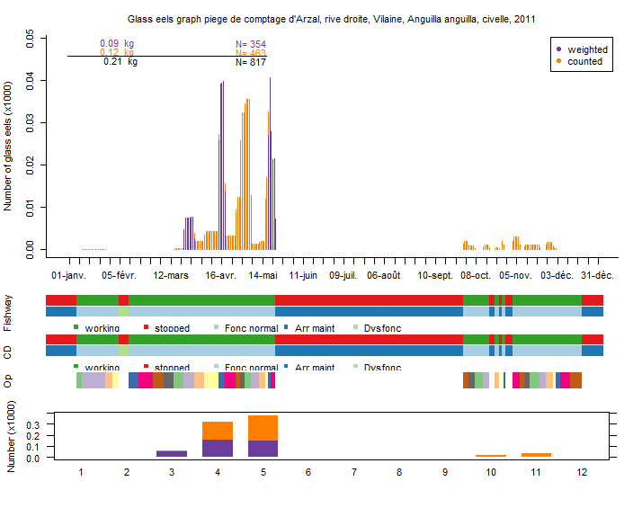

# Summary

Migratory fish (like eel, salmon, shad or lamprey) are patrimonial species with cultural, scientific and economical strong interest [@poisson_eau_2011].
Migratory fishes population are vulnerable as they are often more prone to human impact when migrating in rivers and to the ocean [@mcdowall_1992].
They are often counted at stations when they perform the migrations at some of their lifestages, and these counts provide valuable indices to
the population size and trend. In France, this kind of data are collected by various organizations (e.g. Migratory Associations, Amateur Fishing Federations, public institutions or research laboratories) whose purpose is to monitore fish during a long-time period. To date, there is no structure to homogenize this collection or to organize the valuation of these data.
The objective of the stacomi project is to provide a common database for people monitoring fish migration, so that data from watershed are shared, and stocks exchanging between different basins are better managed. The stacomi database, is an open-source database, it managed with a JAVA interface, and results from
that database are treated directly with the stacomiR package [@R2017]. Data ownership obviously remains that of producers and only producers can decide whether or not they want ta make their data available and in which context. However, the R package is an excellent tool to show the value of sharing informations to compare data across multiple stations and watersheds. At this moment, the Stacomi project is used by people monitoring fish migration throughout France and some Spanish producers have started to use it as well. All messages delivered by the R program are available in French and in English. Some messages are also available in spanish. 
The program is intended to be used by a "non experienced" R user, but all the R code automatically generated by the programm is shown to the user. Thus, it is possible to copy/paste the code and modify it (for example to change the preprogrammed colors or make more complicated changes). 
The package is available from CRAN and a development version is available
from R-Forge.

```{R}
# Installation
# get the package from CRAN
install.packages("stacomiR") 
# get the development version
install.packages("stacomiR", repos="http://R-Forge.R-project.org") 


# Launch the graphical interface
library(stacomiR)
## For user having the stacomi database
stacomi()
## For user without connection to the database
stacomi(gr_interface=FALSE,login_window=FALSE,database_expected=FALSE) 
```

Launching `stacomi()` will create the interface (if the [database provided](https://github.com/MarionLegrandLogrami/stacomiR/tree/master/Installation) in the github installation folder is installed). The interface looks
like :



Below as an example, the glass eel migration at a glass eel trapping ladder located
at the Arzal dam in the Vilaine river (France), in weight and number (top),
the periods and type of operation for the fishway (DF) and the counting device (DC), and the operation (trapping periods) (middle), a summary of migration per month (bottom).

```{R}
# Without a connection at the database we can launch these lines 
# to generate the graph.
# To obtain graphic titles in english uncomment the following line
#Sys.setenv(LANG = "en")
data("r_mig_mult")
data("r_mig_mult_ope")
assign("report_ope",r_mig_mult_ope,envir=envir_stacomi)
data("r_mig_mult_df")
assign("report_df",r_mig_mult_df,envir=envir_stacomi)
data("r_mig_mult_dc")
assign("report_dc",r_mig_mult_dc,envir=envir_stacomi)
r_mig_mult<-calcule(r_mig_mult,silent=TRUE) 

# To avoid call to dev.new() which creates a device per stage, 
# DC, taxa, we simplify the object:
r_mig_mult@taxa@data<- r_mig_mult@taxa@data[1,]
r_mig_mult@stage@data<-r_mig_mult@stage@data[3,]
r_mig_mult@dc@dc_selectionne<-r_mig_mult@dc@dc_selectionne[3]

plot(r_mig_mult,plot.type="standard",silent=TRUE)

```


# References
